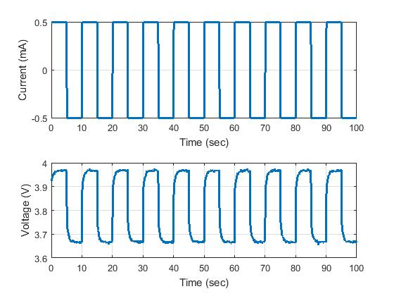
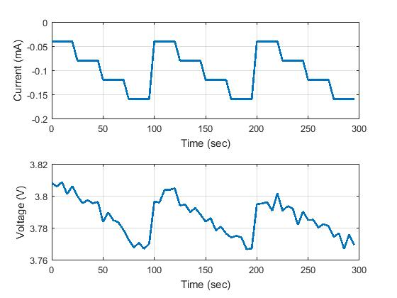
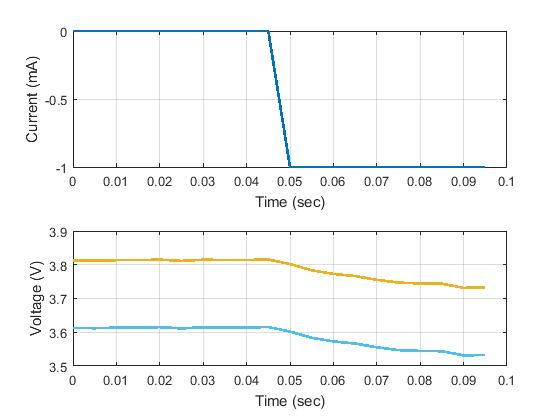
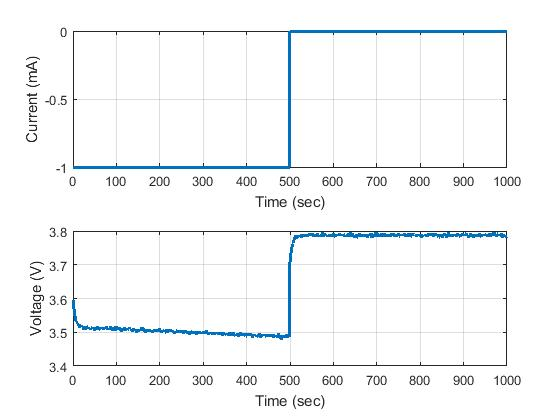

# BattSim Documentation

*This documentation is meant for the **MATLAB** version of `CurretSIM.m`.* A python version will be developed soon to take its place, as the MATLAB version lacks some critical features, and is not as flexible.

## CurretSim

`Curretsim.m` is a MATLAB script that creates current load patterns to pass to the battery simulator. It has a number of options to specify the current load pattern.

### `rectangularnew`



creates a rectangular waveform.

```matlab
%current simulation parameters
delta = 100*10^(-3);
Tc  = 10;  % sampling 
D   = 100; % duration of the simulation
Id = -500; % amplitude of current (mA)

[T,I] = CurretSIM('rectangularnew',-Id, Id, delta, Tc, D);
% T is the time vector
% I is the current vector
```

| Parameter | Description |
|:--------:|:-----------:|
| `-Id` | The minimum current in the waveform |
| `Id` | The maximum current in the waveform |
| `delta` | The current step size |
| `Tc` | The sampling rate of the waveform |
| `D` | The duration of the waveform |

### `staircase`



```matlab
% code in demoBatterySimulator.m

%current simulation parameters
delta = 100*10^(-3);
Tc  = 10;  % sampling 
D   = 100; % duration of the simulation
Id = -500; % amplitude of current (mA)

%current simulation
[T,I] = CurretSIM('staircase',-Id, Id, delta, Tc, D);
```

```matlab
% code in CurretSIM.m that defines the current waveform

Nsp     = 3; % #of staircase pulses
Ns      = 5; % #of samples for each pulse
Nb      = 4; % #of blocks
Imag    = [-40 -80 -120 -160]; % same as the # of blocks
```

Staircase is not completely implemented in CurretSIM.m. There are placeholder values that need to be changed over to parameters that are passed to the function.

### `deepdischarge`



```matlab
% code in CurretSIM.m that defines the current waveform
% no parameters are passed to this function, this waveform is only implemented as a demo for the MATLAB version of CurretSIM.m

    case 'deepdischarge'
        delta    = 5; % milliseconds
        Ns      = 10; % #of samples for each pulse
        Nb      = 2;
        Imag    = [0 -1000]; % same as the #of blocks
        T        = 0:delta:delta*Ns*Nb-1 ;
        T        = T*10^-3;
        T        = T';
        l = 1;
        for k = 1:Nb
            I((k-1)*Ns+1:k*Ns) = Imag(l)*ones(Ns,1);
            l = l+1;
            if(l == Nb+1)
                l = 1;
            end
        end
        I = I*10^-3;
```

### `rectangular`



```matlab
% code in CurretSIM.m that defines the current waveform
% no parameters are passed to this function, this waveform is only implemented as a demo for the MATLAB version of CurretSIM.m

     case 'rectangular'
%         delt = delta;
%         pulsewidth = T;
%         pulsetotal = D;
        delta    = 1000; % milliseconds
        Ns      = 500; % #of samples for each pulse
        Nb      = 2;
        Imag    = [-1000 0]; % same as the #of blocks
        T        = 0:delta:delta*Ns*Nb-1 ;
        T        = T*10^-3;
        T        = T';

        l = 1;
        for k = 1:Nb
            I((k-1)*Ns+1:k*Ns) = Imag(l)*ones(Ns,1);
            l = l+1;
            if(l == Nb+1)
                l = 1;
            end
        end
        I = I*10^-3;
        I = I';
```
